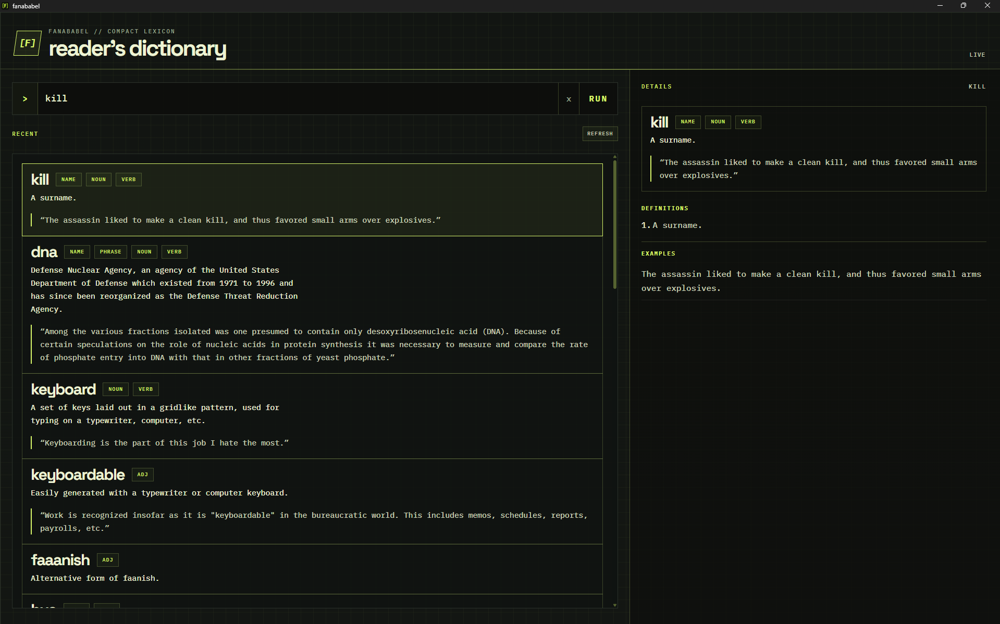

<p align="center">
  
</p>

<h1 align="center">FanaBabel</h1>

<p align="center">
  An offline-first vocabulary companion for reading English literature.
</p>

<p align="center">
  
  
  
</p>

FanaBabel is a local-first desktop dictionary for looking up unfamiliar words without leaving a book or relying on an internet connection. It provides definitions, synonyms, examples, autocomplete, fuzzy search, and a persistent history of recent lookups.

## Screenshot



## Download

Download the latest release from [Releases · MasFana/FanaBabel](https://github.com/MasFana/FanaBabel/releases).

| Package | Download | Recommended for |
| --- | --- | --- |
| Windows installer (NSIS) | [Download `.exe`](https://github.com/MasFana/FanaBabel/releases/download/v0.1.0/fanababel_0.1.0_x64-setup.exe) | Most users; guided installation and Start Menu integration |
| Windows installer (MSI) | [Download `.msi`](https://github.com/MasFana/FanaBabel/releases/download/v0.1.0/fanababel_0.1.0_x64_en-US.msi) | Managed deployments and Windows Installer workflows |
| Portable application | [Download `tauri-app.exe`](https://github.com/MasFana/FanaBabel/releases/download/v0.1.0/tauri-app.exe) | Running the app without an installer |

The current release provides Windows x64 artifacts. See [RELEASE.md](RELEASE.md) for installation instructions, checksums, and release verification details.

## Features

- **Offline dictionary lookup** using data bundled with the desktop application.
- **Fast autocomplete** with keyboard-navigable suggestions.
- **Fuzzy matching** for misspellings and unusual literary vocabulary.
- **Rich word entries** with parts of speech, definitions, synonyms, and examples.
- **Persistent search history** stored in the operating system's application-data directory.
- **Local-first storage** that keeps the read-only dictionary separate from writable user history.
- **Desktop packaging** through Tauri for Windows, macOS, and Linux targets supported by Tauri.

## Architecture

| Layer | Technology | Responsibility |
| --- | --- | --- |
| Desktop shell | [Tauri 2](https://tauri.app/) | Native window, packaging, resource bundling, and frontend/backend IPC |
| Frontend | [React 19](https://react.dev/), [TypeScript](https://www.typescriptlang.org/), [Vite](https://vite.dev/) | Search interface, suggestions, previews, word details, and history |
| Backend | [Rust](https://www.rust-lang.org/) | Lookup commands, normalization, fuzzy matching, and persistence |
| Dictionary database | [SQLite](https://www.sqlite.org/) through `rusqlite` | Bundled word data and local history storage |
| Fuzzy matching | `strsim` | Approximate word matching when prefix suggestions are unavailable |
| Virtualized lists | `@tanstack/react-virtual` | Efficient rendering of the recent-search history |

The bundled dictionary is read-only at `app/src-tauri/resources/dictionary.sqlite`. Runtime history is kept separately in the platform-specific application-data directory so the packaged resource is never modified.

## Repository layout

```text
FanaBabel/
├── app/                    Tauri desktop application
│   ├── src/                React and TypeScript frontend
│   └── src-tauri/          Rust backend and Tauri configuration
└── data-pipeline/          Build-time dictionary generation utilities
```

## Getting started

### Prerequisites

- [Rust and Cargo](https://www.rust-lang.org/tools/install)
- [Node.js](https://nodejs.org/) 20 or newer
- [pnpm](https://pnpm.io/installation)
- Tauri [platform prerequisites](https://tauri.app/start/prerequisites/)
  - On Windows, this includes WebView2 and the Microsoft C++ Build Tools.
  - On macOS and Linux, install the system libraries listed by Tauri for your target distribution.

### Install dependencies

From the repository root:

```powershell
Set-Location app
pnpm install
```

### Run the desktop app

```powershell
pnpm dev:desktop
```

This starts Vite through Tauri and opens the application window. To run only the frontend in a browser:

```powershell
pnpm dev
```

## Verification

Run the frontend type-check and production build:

```powershell
Set-Location app
pnpm build
```

Run the Rust backend tests:

```powershell
Set-Location app/src-tauri
cargo test --quiet
```

## Build and packaging

From `FanaBabel/app`, create a production desktop bundle with:

```powershell
pnpm tauri build
```

The build runs the frontend build first, then packages the Tauri application and its configured resources and icons.

## Dictionary data pipeline

The `data-pipeline` directory contains the build-time tooling used to create the SQLite dictionary resource. It accepts Wiktextract JSONL data and WordNet data, then produces the database and sorted word list consumed by the app.

Generated dictionary data may include content derived from English WordNet and Wiktionary. Releases must record the exact input versions, checksums, retrieval dates, transformation command, attribution, and applicable source licenses.

## Contributing

Contributions are welcome. Keep changes focused, explain behavior changes in pull requests, and add or update tests for backend behavior. Before submitting a change, run `pnpm build` and `cargo test --quiet` from the locations above. Changes involving dictionary data must include the relevant provenance and attribution information.

## License

This repository does not currently contain a project-level license file. Until the maintainers add one, FanaBabel source code should not be assumed to be available for reuse under an open-source license.

Dictionary sources may have separate terms, including CC BY 4.0 for English WordNet and applicable CC BY-SA/GFDL terms for Wiktionary-derived content. Source licenses do not grant a license to the FanaBabel application itself.
